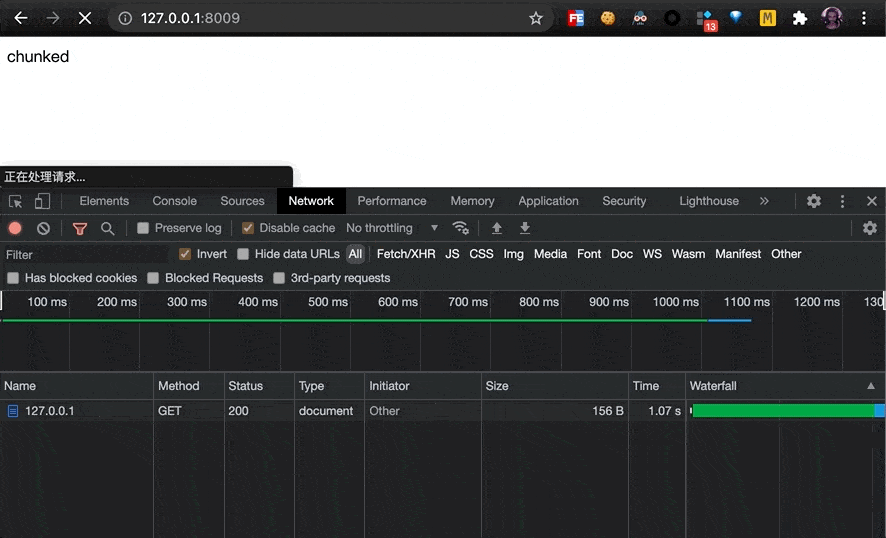

#  `JS` 实现流式打包下载

浏览器中的流式操作可以节省内存，扩大 `JS` 的应用边界，比如我们可以在浏览器里进行视频剪辑，而不用担心视频文件将内存撑爆。

浏览器虽然有流式处理数据的 API，并没有**直接提供**给 `JS` 进行流式下载的能力，也就是说即使我们可以流式的处理数据，但想将其下载到磁盘上时，依然会对内存提出挑战。

这也是我们讨论的前提：

- **流式的操作，必须整个链路都是流式的才有意义，一旦某个环节是非流式（阻塞）的，就无法起到节省内存的作用。**

本篇文章分析了如何在 `JS`中流式的处理数据 ，**流式**的进行下载，主要参考了 [StreamSaver.js](https://github.com/jimmywarting/StreamSaver.js) 的实现方案。

分为如下部分：

1. 流在计算机中的作用
2. 服务器流式响应
3. `JS` 下载文件的方式
4. `JS` 持有数据并下载文件的场景
4. 非流式处理、下载的问题
6. 浏览器流式 `API`
7. `JS ` 流式的实现方案
8. 实现`JS`读取本地文件并打包下载

## 流在计算机中的作用

流这个概念在前端领域中提及的并不多，但是在计算机领域中，流式一个非常常见且重要的概念。

当**流**这个字出现在 IO 的上下文中，常指的得就是分段的读取和处理文件，这样在处理文件时（转换、传输），就不必把整个文件加载到内存中，大大的节省了内存空间的占用。

在实际点说就是，当你用着 `4G` 内存的 `iPhone 13`看电影时，并不需要担心视频文件数据把你的手机搞爆掉。


## 服务器流式响应

在谈下载之前，先提一下流式响应。

如上可知，当我们从服务器下载一个文件时，服务器也不可能把整个文件读取到内存中再进行响应，而是会边读边响应。

那如何进行流式响应呢？

只需要设置一个响应头 `Transfer-Encoding: chunked`，表明我们的响应体是分块传输的就可以了。

以下是一个 `nodejs` 的极简示例，这个服务每隔一秒就会向浏览器进行一次响应，永不停歇。

```js
require('http').createServer((request, response) => {
    response.writeHead(200, {
        'Content-Type': 'text/html',
        'Transfer-Encoding': 'chunked'
    })

    setInterval(() => {
        response.write('chunked\r\n')
    }, 1000)
}).listen(8000);
```

当我们访问 `http://localhost:8000`时，就会如下图所示



## `JS` 下载文件的方式

在 `js` 中下载文件的方式，有如下两类：

```js
// 第一类：页面跳转、打开
location.href
window.open
iframe.src
a[download].click()

// 第二类：Ajax
fetch('/api/download')
	.then(res => res.blob())
	.then(blob => {
    // FileReader.readAsDataURL()
    const url = URL.createObjectURL(blob)
    // 借助第一类方式：location.href、iframe.src、a[download].click()
    window.open(url)
  })
```

不难看出，使用 `Ajax` 下载文件，最终还是要借助第一类方法才可以实现下载。

而第一类的操作都会导致一个行为：**页面级导航跳转**

所以我们可以总结得出浏览器的下载行为：

- 在**页面级的跳转请求**中，检查响应头是否包含 `Content-Disposition: attachment`。对于 `a[download]` 和 `createObjectURL`的 `url` 跳转，可以理解为浏览器帮忙加上了这个响应头。

- `Ajax` 发出的请求并不是页面级跳转请求，所以即使拥有下载响应头也不会触发下载行为。

### 两类下载方式的区别

这两种下载文件的方式有何区别呢？

第一类请求的响应数据直接由**下载线程**接管，可以进行流式下载，一边接收数据**一边往本地写文件**。


第二类由 `JS` 线程接管响应数据，使用 API 将文件数据创建成  `url` 触发下载。


但是相应的 API `createObjectURL`、`readAsDataURL`**必须传入整个文件数据**才能进行下载，是不支持流的。也就是说一旦文件数据到了 `JS` 手中，想要下载，就必须把数据堆在内存中，直到拿到完整数据才能开始下载。

所以当我们从服务器下载文件时，应该尽量避免使用 `Ajax` ，直接使用 `页面跳转类`的 API 让下载线程进行流式下载。

但是有些场景下，我们需要在 `JS` 中处理数据，此时数据在 `JS` 线程中，就不得不面对内存的问题。

### `JS` 持有数据并下载文件的场景

以下场景，我们需要在 `JS` 中处理数据并进行文件下载。

1. 纯前端处理文件流：在线格式转换、解压缩等

   - 整个数据都在前端转换处理，压根没有服务端的事
   - 文章所要讨论的情况

2. 接口鉴权：鉴权方案导致请求必须由 `JS` 发起，如 `cookie + csrfToken`、`JWT`

   - 使用 `ajax` ：简单但是数据都在内存中
   - （推荐）使用 `iframe + form` 实现：麻烦但是可以由下载线程流式下载

3. 服务端返回文件数据，前端转换处理后下载

   - 如服务端返回多个文件，前端打包下载
   - （推荐）去找后端 ~~聊一聊~~


可以看到第一种情况是必须用 `JS` 处理的，我们来看一下如果不使用流式处理的话，会有什么问题。

## 非流式处理、下载的问题

去网上搜索「前端打包」，99% 的内容都会告诉你使用 `JSZip` ，谈起文件下载也都会提起一个 `file-saver`的库（`JSZip` 官网也推荐使用这个库下载文件）。

那我们就看一下这些流行库的的问题。

```js
<script setup lang="ts">
import { onMounted, ref } from "@vue/runtime-core";
import JSZip from 'jszip'
import { saveAs } from 'file-saver'

const inputRef = ref<HTMLInputElement | null>(null);
onMounted(() => {
  inputRef.value?.addEventListener("change", async (e: any) => {
    const file = e.target!.files[0]!
    const zip = new JSZip();
    zip.file(file.name, file);
    const blob = await zip.generateAsync({type:"blob"})
    saveAs(blob, "example.zip");
  });
});
</script>

<template>
  <button @click="inputRef?.click()">JSZip 文件打包下载</button>
  <input ref="inputRef" type="file" hidden />
</template>
```

以上是一个用 `JSZip` 的官方实例构建的 `Vue` 应用，功能很简单，从本地上传一个文件，通过 `JSZip`打包，然后使用 `file-saver` 将其下载到本地。

我们来直接试一下，上传一个 `1G+` 的文件会怎么样？


通过 `Chrome` 的任务管理器可以看到，当前的页面内存直接跳到了 `1G+`。

当然不排除有人的电脑内存比我们硬盘的都大的情况，豪不在乎内存消耗。


OK，即使你的电脑足以支撑在内存中进行随意的数据转换，但浏览器对 `Blob` 对象是有大小限制的。

下面是 `file-saver` 的 `github`：


官网的第一句话就是

> If you need to save really large files bigger than the blob's size limitation or don't have enough RAM, then have a look at the more advanced StreamSaver.js
>
> 如果您需要保存比blob的大小限制更大的文件，或者没有足够的内存，那么可以查看更高级的 StreamSaver.js

然后给出了不同浏览器所支持的 `Max Blob Size`，可以看到 `Chrome` 是 `2G`。

所以不管是出于内存考虑，还是 `Max Blob Size`的限制，我们都有必要去探究一下流式的处理方案。

---

顺便说一下这个库并没有什么黑科技，它的下载方式和我们上面写的是一样的，只不过处理了一些兼容性问题。

下面是源码：


## 浏览器流式 `API`

[Streams API](https://developer.mozilla.org/zh-CN/docs/Web/API/Streams_API) 是浏览器提供给 `JS` 的流式操作数据的接口。

、

其中包含有两个主要的接口：可读流、可写流

### [WritableStream](https://developer.mozilla.org/en-US/docs/Web/API/WritableStream)

创建一个可写流对象，这个对象带有内置的背压和排队。

```js
// 创建
const writableStream = new WritableStream({
  write(chunk) {
    console.log(chunk)
  }
})
// 使用
const writer = writableStream.getWriter()
writer.write(1).then(() => {
  // 应当在 then 再写入下一个数据
	writer.write(2)
})
```

- 创建时传入 `write` 函数，在其中处理具体的写入逻辑（写入可读流）。
- 使用时调用 `getWriter()` 获取流的写入器，之后调用`write` 方法进行数据写入。
- 此时的 `write` 方法是被包装后的，其会返回 `Promise` 用来控制背压，当允许写入数据时才会 `resolve`。
- 背压控制策略参考 [`CountQueuingStrategy`](https://developer.mozilla.org/en-US/docs/Web/API/CountQueuingStrategy/CountQueuingStrategy)，这里不细说。

### [ReadableStream](https://developer.mozilla.org/zh-CN/docs/Web/API/ReadableStream)

创建一个可读的二进制操作，`controller.enqueue`向流中放入数据，`controller.close`表明数据发送完毕。

下面的流每隔一秒就会产生一次数据：

```js
const readableStream = new ReadableStream({
  start(controller) {
		setInterval(() => {
			// 向流中放入数据
			controller.enqueue(value);
    	// controller.close(); 表明数据已发完
		}, 1000)
  }
});
```

从可读流中读取数据：

```js
const reader = readableStream.getReader()
while (true) {
  const {value, done} = await reader.read()
  console.log(value)
  if (done) break
}
```

调用 `getReader()` 可以获取流的读取器，之后调用 `read()` 便会开始读取数据，返回 `Promise`

- 如果流中没有数据，便会阻塞（`Promise penging`）。

- 当调用了`controller.enqueue`或`controller.close`后，`Promise `就会`resolve`。

- `done`：数据发送完毕，表示调用了 `controller.close`。

- `value`：数据本身，表示调用了`controller.enqueue`。

`while (true)` 的写法在其他语言中是非常常见的，如果数据没有读完，我们就重复调用 `read()` ，直到 `done` 为`true`。

`fetch` 请求的响应体和 `Blob` 都已经实现了 `ReadableStream`。

#### Fetch ReadableStream

> [Fetch API](https://developer.mozilla.org/zh-CN/docs/Web/API/Fetch_API) 通过 [`Response`](https://developer.mozilla.org/zh-CN/docs/Web/API/Response) 的属性 [`body`](https://developer.mozilla.org/en-US/docs/Web/API/Response/body) 提供了一个具体的 `ReadableStream` 对象。

流式的读取服务端响应数据：

```js
const response = await fetch('/api/download')
// response.body === ReadableStream
const reader = response.body.getReader()

while(true) {
  const {done, value} = await reader.read()
  console.log(value)
  if (done) break
}
```

#### Blob ReadableStream

`Blob` 对象的 `stream` 方法，会返回一个 `ReadableStream`。

当我们从本地上传文件时，文件对象 `File` 就是继承自`Blob`

流式的读取本地文件：

```js
<input type="file" id="file">

document.getElementById("file")
  .addEventListener("change", async (e) => {
    const file: File = e.target.files[0];

    const reader = file.stream().getReader();
    while (true) {
      const { done, value } = await reader.read();
      console.log(value);
      if (done) break;
    }
	});
```

### [TransformStream](https://developer.mozilla.org/en-US/docs/Web/API/TransformStream)

有了可读、可写流，我们就可以组合实现一个转换流，一端转换写入数据、一端读取数据。

我们利用 `MessageChannel`在两方进行通信

```js
const { port1, port2 } = new MessageChannel()

const writableStream = new WritableStream({
	write(chunk) {
		port1.postMessage(chunk)
	}
})

const readableStream = new ReadableStream({
	start(controller) {
		port2.onmessage = ({ data }) => {
			controller.enqueue(data)
		}
	}
});

const writer = writableStream.getWriter()
const reader = readableStream.getReader()

writer.write(123) // 写入数据

reader.read() // 读出数据 123
```

在很多场景下我们都会这么去使用读写流，所以浏览器帮我们实现了一个标准的转换流：`TransformStream`

使用如下：

```js
const {readable, writable} = new TransformStream()

writable.getWriter().write(123) // 写入数据

readable.getReader().read() // 读出数据 123
```

以上就是我们需要知道的流式 API 的知识，接下来进入正题。

## 前端流式下载

ok，终于到了流式下载的部分。

这里我并不会推翻自己前面所说：

1. 只有页面级跳转会触发下载。

   - 这意味着响应数据直接被下载线程接管。

2.  `createObjectURL`、`readAsDataURL` 只能接收整个文件数据。
- 这意味当数据在前端时，只能整体下载。

所以应该怎么做呢？

### Service worker

是的，黑科技主角`Service worker`，熟悉 `PWA` 的人对它一定不陌生，它可以**拦截**浏览器的请求并**提供**离线缓存。

> [Service Worker API](https://developer.mozilla.org/zh-CN/docs/Web/API/Service_Worker_API)
>
> Service workers 本质上充当 Web 应用程序、浏览器与网络（可用时）之间的代理服务器。这个 API 旨在创建有效的离线体验，它会拦截网络请求并根据网络是否可用来采取适当的动作、更新来自服务器的的资源。
>
> —— MDN

这里有两个关键点：

1. 拦截请求
2. 构建响应

也就是说，通过 `Service worker` 前端完全可以自己充当服务器给下载线程传输数据。

让我们看看这是如何工作的。

### 拦截请求

请求的拦截非常简单，在`Service worker`中注册 `onfetch` 事件，所有的请求发送都会触发其回调。

通过 `event.request` 对象拿到 `Request` 对象，进而检查 `url` 决定是否要拦截。

如果确定要拦截，就调用 `event.respondWith` 并传入 `Response` 对象，既可完成拦截。

```js
self.onfetch = event => {
	const url = event.request.url
	if (url === '拦截') {
      event.respondWith(new Response())
  }
}

```

### new Response

`Response`就是 `fetch()`返回的 `response` 的构造函数。

直接看函数签名：

```ts
interface Response: {
    new(body?: BodyInit | null, init?: ResponseInit): Response
}

type BodyInit = ReadableStream | Blob | BufferSource | FormData | URLSearchParams | string

interface ResponseInit {
    headers?: HeadersInit
    status?: number
    statusText?: string
}
```

可以看到，`Response` 接收两个参数

1. 第一个是响应体 `Body`，其类型可以是 `Blob`、`string`等等，其中可以看到熟悉的 `ReadableStream`可读流
2. 第二个是响应头、状态码等

这意味着：

1. 在响应头中写入`Content-Disposition：attachment`，浏览器就会让下载线程接管响应。
2. 将`Body` 构建成 `ReadableStream`，就可以流式的向下载线程传输数据。

也意味着前端自己就可以进行流式下载！

## 极简实现

我们构建一个最简的例子来将所有知识点串起来：从本地上传文件，流式的读取，流式的下载到本地。

是的这看似毫无意义，但这可以跑通流程，对学习来说足够了。

### 流程图


### 关键点代码分析

1. 通知 `service worker` 准备下载文件，等待 `worker` 返回 `url` 和`writable`

   ```js
   const createDownloadStrean = async (filename) => {
     // 通过 channel 接受数据
     const { port1, port2 } = new MessageChannel();

     // 传递 channel，这样 worker 就可以往回发送消息了
     serviceworker.postMessage({ filename }, [port2]);

   	return new Promise((resolve) => {
     	port1.onmessage = ({data}) => {
         // 拿到url, 发起请求
         iframe.src = data.url;
         document.body.appendChild(iframe);
         // 返回可写流
         resolve(data.writable)
       };
     });
   }
   ```

2. `Service worker` 接受到消息，创建 `url`、`ReadableStream` 、`WritableStream`，将 `url`、`WritableStream`通过 `channel` 发送回去。

   ```js
   self.onmessage = (event) => {
     const filename = event.data.filename
     // 拿到 channel
     const port2 = event.ports[0]
     // 随机一个 url
     const downloadUrl = self.registration.scope + Math.random() + '/' + filename
     // 创建转换流
   	const { readable, writable } = new TransformStream()
   	// 记录 url 和可读流，用于后续拦截和响应构建
   	map.set(downloadUrl, readable)
     // 传回 url 和可写流
   	port2.postMessage({ download: downloadUrl, writable }, [writable])
   }
   ```

3. 主线程拿到 `url` 发起请求（第 1 步 `onmessage`中），`Service worker` 拦截请求 ，使用上一步的 `ReadableStream`创建`Response`并响应。

   ```js
   self.onfetch = event => {
   	const url = event.request.url
     // 从 map 中取出流，存在表示这个请求是需要拦截的
   	const readableStream = map.get(url)
   	if (!readableStream) return null
   	map.delete(url)

   	const headers = new Headers({
   		'Content-Type': 'application/octet-stream; charset=utf-8',
       'Content-Disposition': 'attachment',
   		'Transfer-Encoding': 'chunked'
   	})
   	// 构建返回响应
   	event.respondWith(
   		new Response(readableStream, { headers })
     )
   }
   ```

4. 下载线程拿到响应，开启流式下载（但是此时根本没有数据写入，所以在此就阻塞了）

5. 主线程拿到上传的 `File`对象，获取其`ReadableStream`并读取，将读取到的数据通过 `WritableStream`（第 1 步中返回的）发送出去。

   ```js
   input.addEventListener("change", async (e: any) => {
     const file = e.target!.files[0];
     const reader = file.stream().getReader();
     const writableStream = createDownloadStrean()
     const writable = writableStream.getWriter()
     const pump = async () => {
       const { done, value } = await reader.read();
       if (done) return writable.close()
       await writable.write(value)
       // 递归调用，直到读取完成
       return pump()
     };
     pump();
   })
   ```

7. 当 `WritableStream`写入数据时，下载线程中的 `ReadableStream` 就会接收到数据，文件就会开始下载直到完成。

### 完整代码

```vue
// index.vue
<script setup lang="ts">
import { onMounted, ref } from "@vue/runtime-core";
import { createDownloadStream } from "../utils/common";

const inputRef = ref<HTMLInputElement | null>(null);

// 注册 service worker
async function register() {
  const registed = await navigator.serviceWorker.getRegistration("./");
  if (registed?.active) return registed.active;

  const swRegistration = await navigator.serviceWorker.register("sw.js", {
    scope: "./",
  });

  const sw = swRegistration.installing! || swRegistration.waiting!;

  let listen: any;

  return new Promise<ServiceWorker>((resolve) => {
    sw.addEventListener(
      "statechange",
      (listen = () => {
        if (sw.state === "activated") {
          sw.removeEventListener("statechange", listen);
          resolve(swRegistration.active!);
        }
      })
    );
  });
}

// 向 service worker 申请下载资源
async function createDownloadStream(filename: string) {
  const { port1, port2 } = new MessageChannel();

  const sw = await register();

  sw.postMessage({ filename }, [port2]);

  return new Promise<WritableStream>((r) => {
    port1.onmessage = (e) => {
      const iframe = document.createElement("iframe");
      iframe.hidden = true;
      iframe.src = e.data.download;
      iframe.name = "iframe";
      document.body.appendChild(iframe);
      r(e.data.writable);
    };
  });
}

onMounted(async () => {
  // 监听文件上传
  inputRef.value?.addEventListener("change", async (e: any) => {
    const files: FileList = e.target!.files;
    const file = files.item(0)!;

    const reader = file.stream().getReader();
    const writableStream = await createDownloadStream(file.name);
    const writable = writableStream.getWriter();

    const pump = async () => {
      const { done, value } = await reader.read();
      if (done) return writable.close()
      await writable.write(value)
      pump()
    };

    pump();
  });
});
</script>

<template>
  <button @click="inputRef?.click()">本地流式文件下载</button>
  <input ref="inputRef" type="file" hidden />
</template>

```

```js
// service-worker.js
self.addEventListener('install', () => {
	self.skipWaiting()
})

self.addEventListener('activate', event => {
	event.waitUntil(self.clients.claim())
})

const map = new Map()

self.onmessage = event => {
	const data = event.data

	const filename = encodeURIComponent(data.filename.replace(/\//g, ':'))
		.replace(/['()]/g, escape)
		.replace(/\*/g, '%2A')

	const downloadUrl = self.registration.scope + Math.random() + '/' + filename
	const port2 = event.ports[0]

	// [stream, data]
	const { readable, writable } = new TransformStream()

	const metadata = [readable, data]

	map.set(downloadUrl, metadata)
	port2.postMessage({ download: downloadUrl, writable }, [writable])
}

self.onfetch = event => {
	const url = event.request.url

	const hijacke = map.get(url)

	if (!hijacke) return null
	map.delete(url)

	const [stream, data] = hijacke
	// Make filename RFC5987 compatible
	const fileName = encodeURIComponent(data.filename).replace(/['()]/g, escape).replace(/\*/g, '%2A')

	const headers = new Headers({
		'Content-Type': 'application/octet-stream; charset=utf-8',
		'Transfer-Encoding': 'chunked',
		'response-content-disposition': 'attachment',
		'Content-Disposition': "attachment; filename*=UTF-8''" + fileName
	})

	event.respondWith(new Response(stream, { headers }))
}

```

## 流式压缩下载

跑通了流程之后，压缩也只不过是在传输流之前进行一层转换的事情。

首先我们寻找一个可以流式处理数据的压缩库（你肯定不会想自己写一遍压缩算法），`fflate` 就很符合我们的需求。

然后我们只需要在写入数据前，让 `fflate`先处理一遍数据就可以了。

```js
onMounted(async () => {
  const input = document.querySelector("#file")!;
  input.addEventListener("change", async (e: any) => {
    const stream = createDownloadStrean()
    const file = e.target!.files[0];
    const reader = file.stream().getReader();

    const zip = new fflate.Zip((err, dat, final) => {
      if (!err) {
        fileStream.write(dat);
        if (final) {
          fileStream.close();
        }
      } else {
        fileStream.close();
      }
    });

    const helloTxt = new fflate.ZipDeflate("hello.txt", { level: 9 });
    zip.add(helloTxt);

    while (true) {
      const { done, value } = await reader.read();
      if (done) {
        zip.end();
        break
      };
      helloTxt.push(value)
    }
  });
});

```

是的，就是这么简单。

这里有一份[完整的代码](https://github.com/lei4519/stream-save-example)，感兴趣的可以克隆跑起来看看。

## 参考资料

- [StreamSaver.js](https://github.com/jimmywarting/StreamSaver.js)
- [MDN](https://developer.mozilla.org/zh-CN/)
